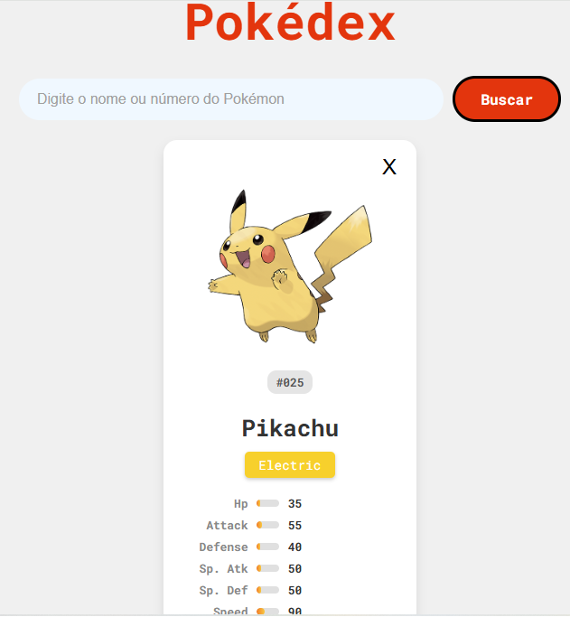

# Pokédex Interativa com PokéAPI

Uma aplicação web estilizada e interativa que funciona como uma Pokédex, construída com HTML, CSS e JavaScript puro. O projeto consome dados da [PokéAPI](https://pokeapi.co/) para buscar e exibir informações detalhadas sobre os Pokémon.



## ✨ Funcionalidades Principais

-   **Busca Dinâmica:** Pesquise qualquer Pokémon pelo seu nome ou número oficial da Pokédex.
-   **Navegação Sequencial:** Utilize os botões "Anterior" e "Próximo" para explorar os Pokémon em ordem numérica.
-   **Visualização de Atributos:** Veja os stats base (HP, Ataque, Defesa, etc.) de cada Pokémon em barras de progresso visuais.
-   **Modo Shiny:** Alterne entre a arte normal e a versão "Shiny" (variante de cor rara) do Pokémon com um único clique.
-   **Descoberta Aleatória:** Ao carregar a página, um Pokémon aleatório é exibido para iniciar a exploração.
-   **Interface Responsiva:** O design se adapta bem a diferentes tamanhos de tela, proporcionando uma boa experiência tanto no desktop quanto em dispositivos móveis.

## 🚀 Tecnologias Utilizadas

Este projeto foi construído utilizando tecnologias fundamentais do desenvolvimento front-end:

-   **HTML5:** Para a estrutura semântica da página.
-   **CSS3:** Para a estilização completa, utilizando Flexbox, Grid e variáveis CSS para um design moderno e de fácil manutenção.
-   **JavaScript (ES6+):** Para toda a lógica e interatividade da aplicação, incluindo:
    -   Consumo de API com a `fetch()` API.
    -   Programação assíncrona com `async/await`.
    -   Manipulação do DOM para criar e atualizar a interface dinamicamente.
    -   Gerenciamento de estado para controlar o Pokémon atual e o modo Shiny.

## ⚙️ Como Executar o Projeto

Como o projeto é construído apenas com tecnologias front-end, não é necessário nenhum processo de build ou instalação complexa.

1.  **Clone o repositório:**
    ```bash
    git clone [https://github.com/TherryD/pokedex.git](https://github.com/TherryD/pokedex.git)
    ```
2.  **Navegue até a pasta do projeto:**
    ```bash
    cd pokedex
    ```
3.  **Abra o arquivo `pokedex.htm`** no seu navegador de preferência.

E pronto! A Pokédex estará funcionando localmente na sua máquina.

---
*Projeto desenvolvido como parte de um estudo prático de desenvolvimento web front-end e interação com APIs.*
